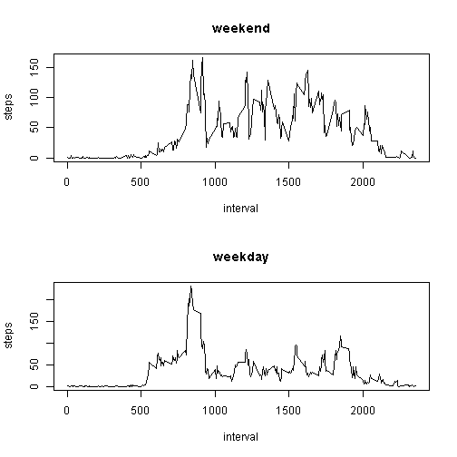

## Loading and preprocessing the data
- Read the data file into database (previously unzipped in working directory)
- Basic EDA: summarize it

```r
activity <- read.csv("activity.csv", )
```
- Basic EDA: summarize data file

```r
summary(activity)
```

```
##      steps                date          interval     
##  Min.   :  0.00   2012-10-01:  288   Min.   :   0.0  
##  1st Qu.:  0.00   2012-10-02:  288   1st Qu.: 588.8  
##  Median :  0.00   2012-10-03:  288   Median :1177.5  
##  Mean   : 37.38   2012-10-04:  288   Mean   :1177.5  
##  3rd Qu.: 12.00   2012-10-05:  288   3rd Qu.:1766.2  
##  Max.   :806.00   2012-10-06:  288   Max.   :2355.0  
##  NA's   :2304     (Other)   :15840
```

## What is mean total number of steps taken per day?
- group steps by day
- view as a histogram

```r
steps_day <- aggregate(steps ~ date, data = activity, FUN = sum)
barplot(steps_day$steps, names.arg = steps_day$date, xlab = "Date", ylab = "# Steps")
```

 

- count the days
- calculate mean and median of steps by day

```r
nrow(steps_day); mean(steps_day$steps)
```

```
## [1] 53
```

```
## [1] 10766.19
```

```r
median(steps_day$steps)
```

```
## [1] 10765
```
## What is the average daily activity pattern?
- view as time series of average daily steps (y-axis) by 5-in interval (x axis)


```r
interval_mean <- aggregate(steps ~ interval, data = activity, FUN = mean)
plot(interval_mean, type = "l")
```

 

- Which interval has the maximum average # of steps

```r
interval_mean$interval[which.max(interval_mean$steps)]
```

```
## [1] 835
```

## Imputing missing values
- Tally the missing values ('NA') in steps variable
- Confirm that tally from summary() function


```r
sum(is.na(activity))
```

```
## [1] 2304
```

```r
##  confirm the tally:
summary(is.na(activity$steps))
```

```
##    Mode   FALSE    TRUE    NA's 
## logical   15264    2304       0
```

- replace 'NA' values with interval means
- summarize the new dataset
- to see if replaced 'NAs' changed usable days, compare the counts of days
  - aggregate new daily steps

```r
activity_noNA1 <- merge(activity, interval_mean, by = "interval", 
    suffixes = c("",".ivl"))
NA_cases <- is.na(activity_noNA1$steps)
activity_noNA1$steps[NA_cases] <- activity_noNA1$steps.ivl[NA_cases]
activity_noNA2 <- activity_noNA1[, c(1:3)]
summary(activity_noNA2)
```

```
##     interval          steps                date      
##  Min.   :   0.0   Min.   :  0.00   2012-10-01:  288  
##  1st Qu.: 588.8   1st Qu.:  0.00   2012-10-02:  288  
##  Median :1177.5   Median :  0.00   2012-10-03:  288  
##  Mean   :1177.5   Mean   : 37.38   2012-10-04:  288  
##  3rd Qu.:1766.2   3rd Qu.: 27.00   2012-10-05:  288  
##  Max.   :2355.0   Max.   :806.00   2012-10-06:  288  
##                                    (Other)   :15840
```

```r
steps_day2 <- aggregate(steps ~ date, data = activity_noNA2, FUN = sum)
```

- count the raw & raw + imputed days; show difference

```r
no_Raw_days <- nrow(steps_day) 
no_Imputed_days <- nrow(steps_day2) 
```

### 8 *all 'NA'* days recovered, now included: 
### Raw: 53 days
### Imputed: 61 days
- Imputed Paramaters: mean median  

```r
mean(steps_day2$steps); median(steps_day2$steps)
```

```
## [1] 10766.19
```

```
## [1] 10766.19
```

- view histogram of new dataset having imputed missing data

```r
steps_day2 <- aggregate(steps ~ date, data = activity_noNA2, FUN = sum)
barplot(steps_day2$steps, names.arg = steps_day2$date, xlab = "Date", 
        ylab = "# Steps")
```

 

### The introduction of imputed values based on means reduces the overall 
### variation of the dataset. The additional 8
### days of imputed values biases the data towards to center of the distribution.  
  
  
## Are there differences in activity patterns between weekdays and weekends?
- Add factor variable for weekday\weekend classification


```r
dayclass <- function(date) {
    if (weekdays(as.Date(date)) %in% c("Saturday", "Sunday")) {
        "weekend"
    } else {
        "weekday"
    }
}
activity_noNA2$dayclass <- as.factor(sapply(activity_noNA2$date, dayclass))
```

- view 2 panel time series plot
-- intervals (x axis) ; mean steps (y axis)
-- by day class (weekend or weekday) per panel

```r
par(mfrow = c(2, 1))
for (type in c("weekend", "weekday")) {
    steps_wd <- aggregate(steps ~ interval, data = activity_noNA2, 
        subset = activity_noNA2$dayclass == type, FUN = mean)
    plot(steps_wd, type = "l", main = type)
}
```

 
